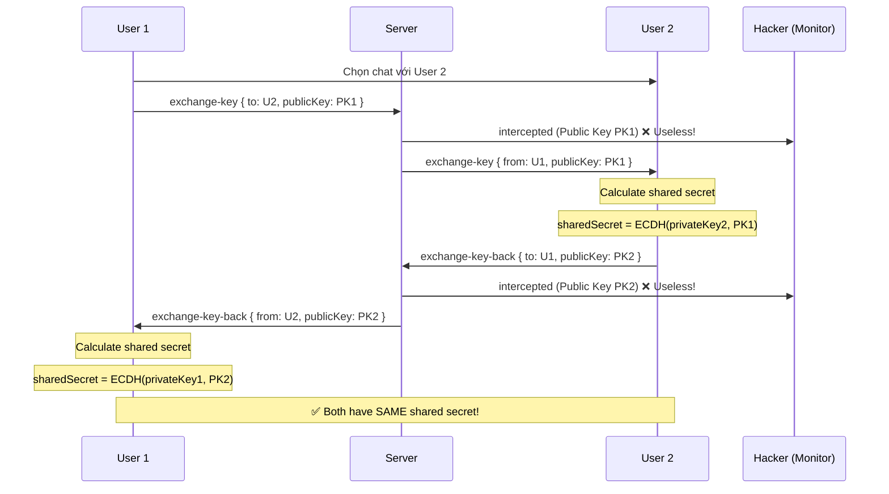

# E2EE Implementation với ECDH + AES-256-CTR

## 🔐 Tổng quan

Ứng dụng này triển khai **End-to-End Encryption (E2EE)** sử dụng:

- **ECDH (Elliptic Curve Diffie-Hellman)** cho key exchange
- **AES-256-CTR** cho message encryption
- **secp256k1** curve (cùng curve Bitcoin sử dụng)

## 📋 Flow hoàn chỉnh

### 1. Khởi tạo và Key Generation

```
User 1 connects → Generate private key (32 bytes random)
                → Derive public key = secp256k1.getPublicKey(privateKey)
                → Send public key to server (hex format)
```

```
User 2 connects → Generate private key (32 bytes random)
                → Derive public key = secp256k1.getPublicKey(privateKey)
                → Send public key to server (hex format)
```

### 2. Key Exchange Process (ECDH)



### 3. Message Encryption & Decryption

#### Gửi tin nhắn:

```typescript
// User 1 gửi message
const message = 'Hello!';

// 1. Generate random IV (16 bytes)
const iv = crypto.getRandomBytes(16);

// 2. Encrypt với AES-256-CTR
const encrypted = await crypto.subtle.encrypt(
  { name: 'AES-CTR', counter: iv, length: 128 },
  sharedSecret, // Shared secret làm key
  message
);

// 3. Gửi qua server
socket.emit('message', {
  to: user2.socketId,
  encryptedMessage: base64(encrypted),
  iv: base64(iv),
});
```

#### Nhận tin nhắn:

```typescript
// User 2 nhận message
socket.on('message', async ({ encryptedMessage, iv }) => {
  // Decrypt với shared secret
  const decrypted = await crypto.subtle.decrypt(
    { name: 'AES-CTR', counter: base64Decode(iv), length: 128 },
    sharedSecret, // Cùng shared secret!
    base64Decode(encryptedMessage)
  );

  console.log(decrypted); // "Hello!"
});
```

### 4. Monitor/Hacker Mode - Intercepted Messages

```
Hacker intercepts:
├── exchange-key: Public Key 1 → ❌ Cannot derive shared secret
├── exchange-key-back: Public Key 2 → ❌ Cannot derive shared secret
└── message: { encryptedMessage, iv } → ❌ Cannot decrypt without shared secret

Server chỉ chuyển tiếp:
- Public keys (không có giá trị nếu không có private key)
- Encrypted messages (không thể decrypt)
```

## 🔒 Security Properties

### ✅ Forward Secrecy

- Mỗi session tạo private key mới
- Compromise trong tương lai không ảnh hưởng messages cũ

### ✅ Perfect Forward Secrecy (PFS)

- Có thể rotate keys cho mỗi conversation
- Mỗi cặp users có shared secret riêng

### ✅ End-to-End Encryption

- Server **KHÔNG BAO GIỜ** thấy:
  - Private keys (never transmitted)
  - Shared secrets (calculated locally)
  - Plaintext messages (only encrypted data)

### ✅ Man-in-the-Middle Protection

- ECDH ensures both parties calculate same shared secret
- Attacker cannot derive shared secret from public keys
- Even if server is compromised, cannot decrypt

## 🧪 So sánh với RSA approach cũ

| Feature                 | RSA (Cũ)                    | ECDH + AES (Mới)                |
| ----------------------- | --------------------------- | ------------------------------- |
| Key Exchange            | Manual exchange public keys | Automatic ECDH                  |
| Encryption              | RSA public key              | AES-256-CTR with shared secret  |
| Performance             | Slow (RSA encryption)       | Fast (AES hardware accelerated) |
| Key Size                | 2048+ bits                  | 256 bits (same security)        |
| Perfect Forward Secrecy | ❌ No                       | ✅ Yes                          |
| Message Size Limit      | Limited by RSA key size     | ✅ Unlimited                    |

## 📁 File Changes

### `utils/crypto.ts`

- ✅ `generateKeyPair()` - Generate ECDH key pair
- ✅ `calculateSharedSecret()` - ECDH shared secret calculation
- ✅ `encryptMessage()` - AES-256-CTR encryption
- ✅ `decryptMessage()` - AES-256-CTR decryption
- ✅ `toHex()` / `fromHex()` - Helpers

### `app/(tabs)/e2ee.tsx`

- ✅ Key exchange flow với `exchange-key` events
- ✅ Store shared secrets per user
- ✅ Auto-initiate key exchange khi chưa có shared secret
- ✅ Decrypt messages với shared secret

### `backend-e2ee/server.js`

- ✅ `exchange-key` event handler
- ✅ `exchange-key-back` event handler
- ✅ Broadcast intercepted keys/messages to monitors

## 🚀 Test Flow

1. **Start Backend:**

   ```bash
   cd backend-e2ee
   npm install
   npm start
   ```

2. **Start App:**

   ```bash
   cd demo-e2ee
   npm install
   npm start
   ```

3. **Test Scenarios:**

   - User 1: Normal mode → Register
   - User 2: Normal mode → Register
   - User 1: Select User 2 → Auto key exchange
   - User 1: Send "Hello" → Encrypted with shared secret
   - User 2: Receive → Decrypt with shared secret

   **Monitor Mode:**

   - Hacker: Monitor mode → Register
   - See intercepted public keys → ❌ Cannot use
   - See encrypted messages → ❌ Cannot decrypt

## 🔍 Debug Console Logs

### User 1:

```
🔑 Sending key exchange to: User2
🔑 Received key exchange response from: User2
✅ Shared secret established with: User2
my private key: 3f8a...
my public key: 04a1b2...
my shared secret: 7c3d...
```

### User 2:

```
🔑 Received key exchange from: User1
🔑 Sending key exchange response to: User1
✅ Shared secret established with: User1
my private key: 9e2c...
my public key: 0489fe...
my shared secret: 7c3d... (SAME!)
```

### Hacker (Monitor):

```
📡 User1 → User2
Encrypted Message (Full):
dGhpcyBpcyBlbmNyeXB0ZWQgZGF0YQ==
🔒 Cannot decrypt without private key
```

## 📚 References

- [ECDH on Wikipedia](https://en.wikipedia.org/wiki/Elliptic-curve_Diffie%E2%80%93Hellman)
- [AES-CTR Mode](<https://en.wikipedia.org/wiki/Block_cipher_mode_of_operation#Counter_(CTR)>)
- [secp256k1 Curve](https://en.bitcoin.it/wiki/Secp256k1)
- [@noble/curves Library](https://github.com/paulmillr/noble-curves)

## ⚠️ Production Considerations

Để production-ready, cần thêm:

1. **Key Verification** - Verify public keys với fingerprints
2. **Key Rotation** - Rotate keys định kỳ
3. **Authentication** - Verify user identity trước khi exchange keys
4. **Certificate Pinning** - Prevent MITM attacks
5. **Secure Key Storage** - Store private keys trong secure enclave
6. **Message Authentication** - Add HMAC để verify message integrity
7. **Replay Protection** - Add nonce/timestamp để prevent replay attacks
